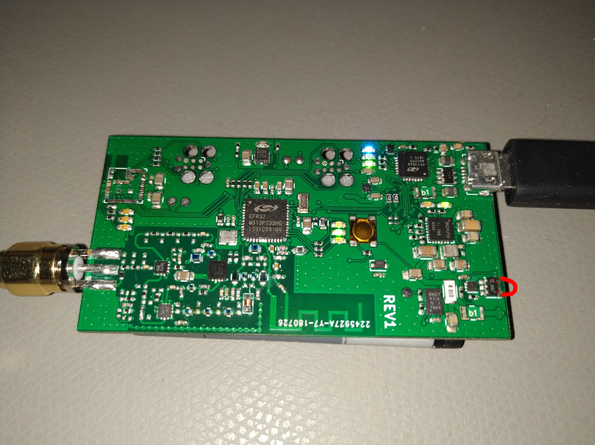

# portable70 programming tool

## Install

This guide assumes that you use Ubuntu 18.04-19.10.
Install all dependencies by executing:

```sh
sudo apt install python3-matplotlib python3-serial python3-scipy
```

To use the programming tool, connect the portable70 using its Micro-USB port to the computer.

On linux either execute the following command and re-login to your session:

```sh
usermod -a -G dialout <YOUR USERNAME>
```

Or use this to temporarily set the permissions for the serial port:

```sh
chmod 777 /dev/ttyUSB0
```

## Usage

### Initial configuration

```sh
python3 main.py --config --callsign <YOUR CALLSIGN> --freq 433000000 --offset 50000 --persist
```

This configures the portable70 startup parameters to 433MHz with a 50kHz transmit offset using your callsign.

### RSSI debug

To debug the pulse detection and RSSI measurement use the following command:

```sh
python3 main.py --config --rssi
```

## Hardware

Due to a hardware bug, after installing a battery, the following pins of the protections MOSFET must be shorted for a short period of time.

